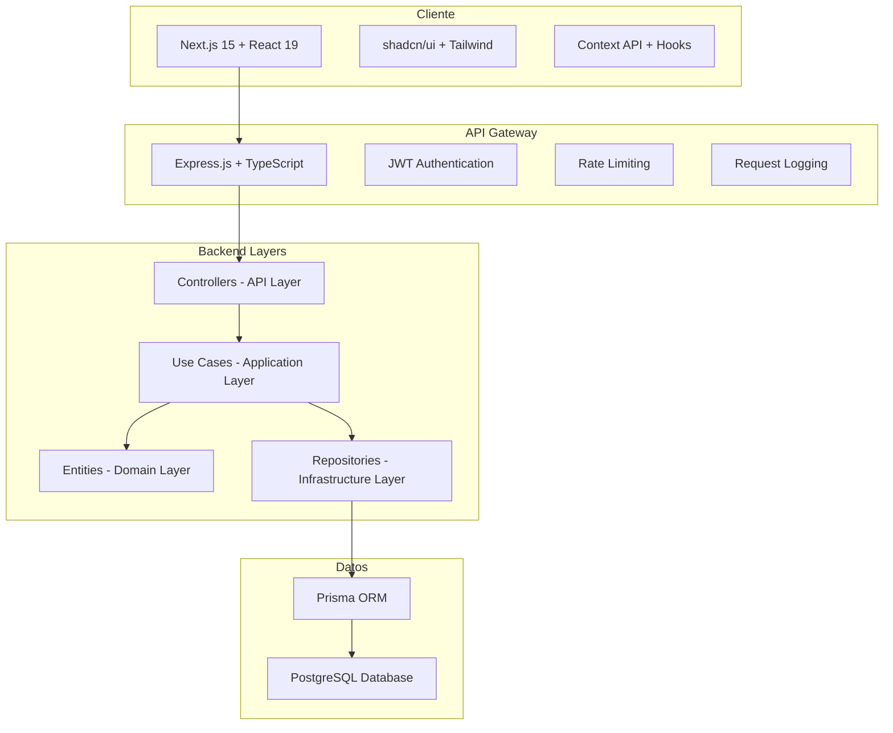
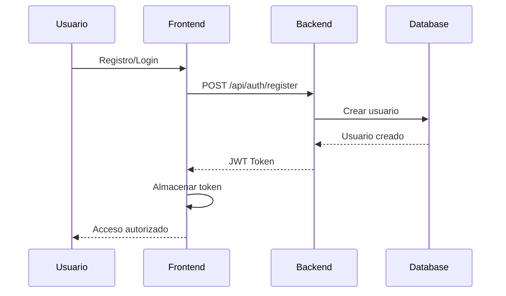

# Presentación del Proyecto: Todo App Full-Stack

**Aplicación de Gestión de Tareas con Arquitectura Limpia**

---

## 📋 Agenda

1. [Visión General del Proyecto](#1-visión-general-del-proyecto)
2. [Arquitectura del Sistema](#2-arquitectura-del-sistema)
3. [Backend: Clean Architecture](#3-backend-clean-architecture)
4. [Frontend: Arquitectura Modular](#4-frontend-arquitectura-modular)
5. [Decisiones Arquitectónicas](#5-decisiones-arquitectónicas-clave)
6. [Tecnologías y Justificación](#6-tecnologías-y-justificación)
7. [Características Destacadas](#7-características-destacadas)
8. [Casos de Uso y Funcionalidades](#8-casos-de-uso-y-funcionalidades)
9. [Seguridad e Integridad](#9-seguridad-e-integridad)
10. [Business Intelligence](#10-business-intelligence)
11. [Escalabilidad y Mantenimiento](#11-escalabilidad-y-mantenimiento)
12. [Demostración Técnica](#12-demostración-técnica)

---

## 1. Visión General del Proyecto

### 🎯 **Objetivo**

Desarrollar una aplicación completa de gestión de tareas que demuestre las mejores prácticas modernas de desarrollo full-stack, con énfasis en arquitectura limpia, seguridad y experiencia de usuario.

### 🏗️ **Estructura del Monorepo**

```
todo-app/
├── src/
│   ├── backend/          # API REST con Clean Architecture
│   └── frontend/         # Aplicación Next.js con React 19
├── doc/                  # Documentación técnica completa
├── collection/           # Scripts SQL y análisis de datos
└── Configuración del workspace (pnpm)
```

### 📊 **Métricas del Proyecto**

- **Backend**: ~15,000 líneas de código TypeScript
- **Frontend**: ~12,000 líneas de código React/TypeScript
- **Cobertura**: Arquitectura limpia en 4 capas
- **APIs**: 15+ endpoints RESTful completamente documentados
- **BI Queries**: 10 consultas de inteligencia de negocio optimizadas

---

## 2. Arquitectura del Sistema

### 🔄 **Arquitectura de Alto Nivel**



### 🧩 **Principios Arquitectónicos**

1. **Separación de Responsabilidades**: Cada capa tiene una responsabilidad específica
2. **Inversión de Dependencias**: Las dependencias apuntan hacia el interior
3. **Modularidad**: Componentes independientes y reutilizables
4. **Escalabilidad**: Preparado para crecimiento horizontal y vertical

---

## 3. Backend: Clean Architecture

### 📐 **Implementación de Clean Architecture**

```
┌─────────────────────────────────────────────┐
│         API Layer (Controllers, Routes)     │
├─────────────────────────────────────────────┤
│    Application Layer (Use Cases, DTOs)      │
├─────────────────────────────────────────────┤
│      Domain Layer (Entities, Rules)         │
├─────────────────────────────────────────────┤
│  Infrastructure (Database, External APIs)   │
└─────────────────────────────────────────────┘
```

### 🎯 **Capa de Dominio (Core)**

```typescript
// Ejemplo: Task Entity
export class Task {
  constructor(
    public readonly id: TaskId,
    public title: string,
    public description: string | null,
    public completed: boolean,
    public priority: Priority,
    public dueDate: Date | null,
    public readonly userId: UserId
  ) {
    this.validateTitle(title);
  }

  private validateTitle(title: string): void {
    if (!title || title.trim().length === 0) {
      throw new AppError("El título de la tarea es requerido", 400);
    }
  }
}
```

**¿Por qué Clean Architecture?**

- ✅ **Testabilidad**: Lógica de negocio independiente de frameworks
- ✅ **Mantenibilidad**: Cambios en una capa no afectan otras
- ✅ **Flexibilidad**: Fácil cambio de tecnologías (DB, Framework)
- ✅ **Comprensibilidad**: Estructura clara y predecible

### 🔧 **Capa de Aplicación (Use Cases)**

```typescript
export class CreateTaskUseCase {
  constructor(
    private taskRepository: ITaskRepository,
    private tagRepository: ITagRepository
  ) {}

  async execute(dto: CreateTaskDTO, userId: number): Promise<Task> {
    // Validación de negocio
    const task = new Task(/* ... */);

    // Persistencia a través de interfaces
    return await this.taskRepository.save(task);
  }
}
```

### 🗄️ **Capa de Infraestructura**

```typescript
export class PrismaTaskRepository implements ITaskRepository {
  async save(task: Task): Promise<Task> {
    const prismaTask = await this.prisma.task.create({
      data: TaskMapper.toPersistence(task),
    });
    return TaskMapper.toDomain(prismaTask);
  }
}
```

---

## 4. Frontend: Arquitectura Modular

### 🧩 **Patrón de Módulos por Características**

```
modules/
├── auth/              # Autenticación completa
│   ├── components/    # UI específica de auth
│   ├── context/       # Estado de autenticación
│   ├── hooks/         # useAuth, useLogin, etc.
│   ├── services/      # API calls
│   └── types/         # TypeScript definitions
├── task/              # Gestión de tareas
└── category/          # Gestión de categorías
```

### 🔄 **Gestión de Estado Jerárquica**

```typescript
// Jerarquía de Providers
<AuthProvider>
  <CategoryProvider>
    <TaskProvider>
      <ThemeProvider>{/* Componentes de la App */}</ThemeProvider>
    </TaskProvider>
  </CategoryProvider>
</AuthProvider>
```

**¿Por qué esta arquitectura modular?**

- ✅ **Escalabilidad**: Nuevas características como módulos independientes
- ✅ **Reutilización**: Hooks y componentes compartibles
- ✅ **Mantenimiento**: Cada módulo es autónomo
- ✅ **Testing**: Pruebas unitarias por módulo

### 🎨 **Sistema de Componentes**

```typescript
// Ejemplo: Componente compuesto para tareas
<TaskDialog>
  <TaskDialog.Trigger>
    <Button>Nueva Tarea</Button>
  </TaskDialog.Trigger>
  <TaskDialog.Content>
    <TaskForm onSubmit={handleSubmit} />
  </TaskDialog.Content>
</TaskDialog>
```

---

## 5. Decisiones Arquitectónicas Clave

### 🚀 **1. Monorepo con pnpm**

**Decisión**: Usar pnpm workspaces para gestionar backend y frontend
**Justificación**:

- ✅ **Compartir dependencias**: Reduce duplicación
- ✅ **Scripts centralizados**: `pnpm run dev` inicia todo
- ✅ **Versionado unificado**: Un solo repositorio para todo el proyecto
- ✅ **CI/CD simplificado**: Deploy coordinado

### 🏗️ **2. Clean Architecture en Backend**

**Decisión**: Implementar arquitectura hexagonal completa
**Justificación**:

- ✅ **Independencia de frameworks**: Lógica de negocio pura
- ✅ **Testabilidad máxima**: Cada capa se prueba independientemente
- ✅ **Cambios seguros**: Modificar infraestructura sin afectar negocio
- ✅ **Documentación viva**: Código autodocumentado por estructura

### 🎯 **3. Feature-First Frontend**

**Decisión**: Organizar por características, no por tipo de archivo
**Justificación**:

- ✅ **Cohesión alta**: Todo lo relacionado está junto
- ✅ **Desarrollo en equipo**: Diferentes devs pueden trabajar en paralelo
- ✅ **Code splitting natural**: Lazy loading por características
- ✅ **Maintainability**: Cambios localizados por feature

### 🔒 **4. JWT + User Isolation**

**Decisión**: Autenticación stateless con aislamiento completo de usuarios
**Justificación**:

- ✅ **Seguridad**: Cada usuario solo ve sus datos
- ✅ **Escalabilidad**: Sin estado en servidor
- ✅ **Performance**: Validación rápida con JWT
- ✅ **Privacy**: Aislamiento total de datos

### 📊 **5. Prisma como ORM**

**Decisión**: Usar Prisma en lugar de SQL directo o ORMs tradicionales
**Justificación**:

- ✅ **Type Safety**: Tipos generados automáticamente
- ✅ **Developer Experience**: Excelente tooling y migraciones
- ✅ **Performance**: Query optimization automática
- ✅ **Schema Evolution**: Migraciones seguras y versionadas

---

## 6. Tecnologías y Justificación

### 🔧 **Backend Stack**

| Tecnología     | Versión | Justificación                           |
| -------------- | ------- | --------------------------------------- |
| **Node.js**    | 18+     | Runtime maduro, gran ecosistema         |
| **TypeScript** | 5.0     | Type safety, mejor developer experience |
| **Express.js** | 5.1     | Framework minimalista, no opinionado    |
| **Prisma**     | 6.16    | ORM moderno con excelente DX            |
| **PostgreSQL** | 12+     | Base de datos robusta, ACID compliant   |
| **Zod**        | 4.1     | Validación type-safe en runtime         |
| **JWT**        | 9.0     | Estándar para autenticación stateless   |

### 🎨 **Frontend Stack**

| Tecnología          | Versión | Justificación                               |
| ------------------- | ------- | ------------------------------------------- |
| **Next.js**         | 15.5    | SSR, App Router, optimizaciones automáticas |
| **React**           | 19.1    | Concurrent features, mejor performance      |
| **TypeScript**      | 5.0     | Consistencia con backend                    |
| **Tailwind CSS**    | 4.0     | Utility-first, desarrollo rápido            |
| **shadcn/ui**       | Latest  | Componentes accesibles, customizables       |
| **React Hook Form** | Latest  | Performance, validación sencilla            |

---

## 7. Características Destacadas

### 🔍 **1. Filtrado Avanzado**

```typescript
// Ejemplo de filtrado complejo
const filters = {
  completed: false,
  priority: "alta",
  categoryId: 1,
  tagIds: [1, 2, 3],
  dueDateFrom: "2023-12-01",
  dueDateTo: "2023-12-31",
  search: "documentation",
};
```

**Implementación Backend**:

- Query builder dinámico con Prisma
- Filtros combinables y optimizados
- Paginación automática para performance

### 🛡️ **2. Rate Limiting Multinivel**

```typescript
const rateLimits = {
  general: { window: "15min", limit: 100 },
  auth: { window: "15min", limit: 5 },
  registration: { window: "1hour", limit: 3 },
  crud: { window: "15min", limit: 200 },
};
```

### 📝 **3. Request Logging Avanzado**

- **Performance monitoring**: Detección automática de requests lentos
- **Security logging**: Redacción de datos sensibles
- **Colorized output**: Logs legibles en desarrollo
- **Structured logging**: Formato JSON para producción

### 🎨 **4. Dark/Light Theme**

- **System preference detection**: Automático según SO
- **Persistence**: Guarda preferencia del usuario
- **Smooth transitions**: Animaciones suaves entre temas
- **Component variants**: Cada componente soporta ambos temas

---

## 8. Casos de Uso y Funcionalidades

### 👤 **Gestión de Usuarios**



### 📋 **Gestión de Tareas**

**Características Principales**:

- ✅ **CRUD completo**: Crear, leer, actualizar, eliminar
- ✅ **Prioridades**: Tres niveles (baja, media, alta)
- ✅ **Fechas de vencimiento**: Control temporal
- ✅ **Estados**: Pendiente/Completada
- ✅ **Categorización**: Organización flexible
- ✅ **Etiquetado**: Sistema de tags múltiples

### 🏷️ **Sistema de Organización**

```typescript
// Ejemplo de estructura de datos
interface Task {
  id: number;
  title: string;
  description?: string;
  completed: boolean;
  priority: "baja" | "media" | "alta";
  dueDate?: Date;
  category?: Category;
  tags: Tag[];
  user: User;
}
```

---

## 9. Seguridad e Integridad

### 🔐 **Modelo de Seguridad**

```typescript
// Ejemplo de middleware de autenticación
export const authMiddleware = async (
  req: Request,
  res: Response,
  next: NextFunction
) => {
  const token = extractToken(req);
  const payload = verifyJWT(token);
  req.user = await getUserById(payload.userId);
  next();
};

// Aislamiento de datos por usuario
const getUserTasks = (userId: number) => {
  return prisma.task.findMany({
    where: { userId }, // Filtro automático por usuario
  });
};
```

### 🛡️ **Capas de Protección**

1. **Autenticación**: JWT tokens con expiración
2. **Autorización**: Aislamiento total por usuario
3. **Validación**: Zod schemas en toda entrada de datos
4. **Rate Limiting**: Protección contra abuso
5. **SQL Injection**: Prisma con queries parametrizadas
6. **XSS Protection**: Sanitización automática

### 🔒 **Privacy by Design**

- **User Isolation**: Cada usuario solo ve sus datos
- **Data Encryption**: Passwords hasheados con bcrypt
- **Token Security**: JWT con secrets seguros
- **CORS Configuration**: Solo orígenes autorizados

---

## 10. Business Intelligence

### 📊 **Consultas Implementadas**

1. **Análisis de Participación**: Promedio de tareas por usuario
2. **Tendencias de Completado**: Tasas diarias por prioridad
3. **Rendimiento por Categoría**: Análisis de efectividad
4. **Patrones de Productividad**: Horas y días pico
5. **Análisis de Vencimientos**: Gestión de deadlines
6. **Uso de Etiquetas**: Tags más populares y efectivos
7. **Retención de Usuarios**: Métricas de actividad
8. **Distribución de Prioridades**: Patrones de urgencia
9. **Tendencias Estacionales**: Variaciones temporales
10. **Benchmarking**: Top performers del sistema

### 🎯 **Ejemplo de Query BI**

```sql
-- Análisis de productividad por usuario
WITH user_productivity AS (
  SELECT
    u.id,
    u.name,
    COUNT(t.id) as total_tasks,
    COUNT(CASE WHEN t.completed THEN 1 END) as completed_tasks,
    ROUND(
      COUNT(CASE WHEN t.completed THEN 1 END) * 100.0 /
      NULLIF(COUNT(t.id), 0), 2
    ) as completion_rate
  FROM usuarios u
  LEFT JOIN tareas t ON u.id = t."userId"
  WHERE t."createdAt" >= NOW() - INTERVAL '30 days'
  GROUP BY u.id, u.name
)
SELECT * FROM user_productivity
ORDER BY completion_rate DESC;
```

---

## 11. Escalabilidad y Mantenimiento

### 📈 **Preparado para Escalar**

**Backend Scaling**:

- ✅ **Horizontal**: Stateless design permite múltiples instancias
- ✅ **Database**: Connection pooling y query optimization
- ✅ **Caching**: Preparado para Redis/Memcached
- ✅ **Microservices**: Arquitectura permite separación por dominio

**Frontend Scaling**:

- ✅ **Code Splitting**: Automático por rutas y features
- ✅ **ISR/SSR**: Next.js optimizations out-of-the-box
- ✅ **CDN Ready**: Static assets optimizados
- ✅ **Progressive Enhancement**: Funciona sin JavaScript

### 🔧 **Mantenibilidad**

**Code Quality**:

```typescript
// Ejemplo de código autodocumentado
export class CreateTaskUseCase {
  /**
   * Creates a new task for the authenticated user
   * @param dto - Task creation data
   * @param userId - ID of the task owner
   * @returns Created task with populated relations
   */
  async execute(dto: CreateTaskDTO, userId: number): Promise<Task> {
    // Implementation with clear business logic
  }
}
```

**Documentation**:

- 📚 **README completos**: Setup y usage para cada proyecto
- 📋 **API Documentation**: Swagger/OpenAPI automático
- 🏗️ **Architecture Docs**: Context.md detallados
- 🔧 **Code Comments**: JSDoc en funciones críticas

---

## 12. Demostración Técnica

### 🚀 **Quick Start Demo**

```bash
# 1. Setup completo en 5 comandos
git clone <repo-url>
cd todo-app
pnpm install
cp src/backend/example.env.txt src/backend/.env
pnpm run db:migrate

# 2. Seed con datos de prueba
psql -U todo_user -d todo_app -f collection/seed.sql

# 3. Inicio de desarrollo
pnpm run dev

# ✅ Apps corriendo:
# Frontend: http://localhost:3000
# Backend: http://localhost:3001
# API Docs: http://localhost:3001/api-docs
```

### 🔑 **Credenciales de Prueba**

```
Email: john.doe@example.com
Password: password123

# 20 usuarios adicionales con mismo password
usuario1@ejemplo.com - password123
usuario2@ejemplo.com - password123
...
```

### 📊 **Datos Generados**

- **21 usuarios** (1 default + 20 generados)
- **1,050+ tareas** con distribución realista
- **Categorías y tags** para cada usuario
- **Diferentes patrones de productividad**
- **Timestamps** del último año
- **Prioridades mixtas** y estados variados

---

## 🎯 Conclusiones

### ✅ **Objetivos Cumplidos**

1. **Arquitectura Limpia**: Implementación completa con separación clara
2. **Full-Stack Moderno**: Tecnologías cutting-edge bien integradas
3. **Production Ready**: Logging, rate limiting, seguridad, documentación
4. **Developer Experience**: Setup fácil, documentación completa
5. **Business Value**: BI queries y métricas reales
6. **Scalability**: Preparado para crecimiento

### 🚀 **Valor Técnico Demostrado**

- **Clean Code**: Principios SOLID aplicados consistentemente
- **Type Safety**: TypeScript end-to-end
- **Security First**: Múltiples capas de protección
- **Performance**: Optimizaciones en cada layer
- **Maintainability**: Estructura clara y documentación completa

### 📈 **Extensibilidad Futura**

- **Real-time Features**: WebSockets para colaboración
- **Mobile App**: React Native con shared business logic
- **AI Integration**: Sugerencias inteligentes de tareas
- **Team Features**: Colaboración y espacios de trabajo
- **Analytics Dashboard**: Visualización de métricas BI

---

**¡Gracias por su atención!**

_¿Preguntas sobre la arquitectura, implementación o decisiones técnicas?_
